# 【UE】Select Manager Quick Start

## quick start

1.Create an optional blueprint BP_A derived from BP_OptionBase

 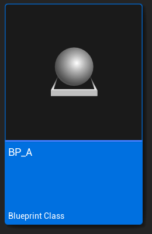 

2. Implement related methods in BP_A

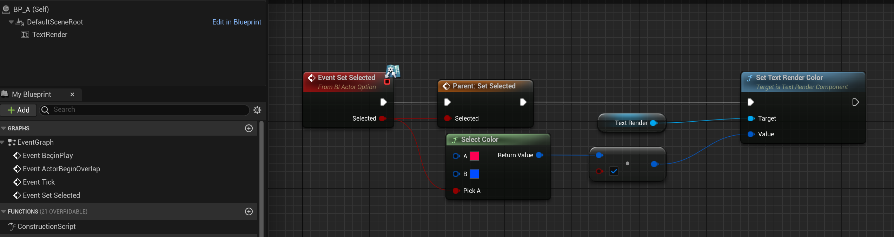 

The other two methods do not need to be implemented, the parent class has already implemented them.

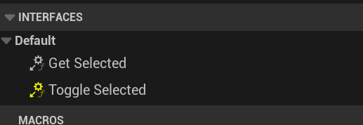 

3.Put multiple BP_A in the scene

 

4. Derive the subclass BP_AManager of Manager and put it into the scene

 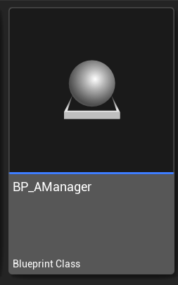 

 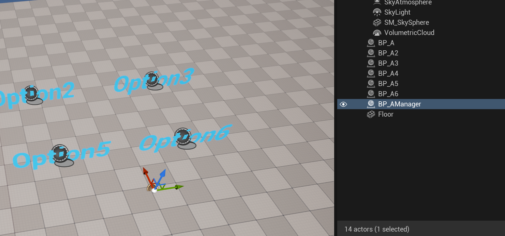

5.Add options to the management class, there are many ways

Method 1: Direct quotation

 

Method 2: Use blueprint nodes to set entry options

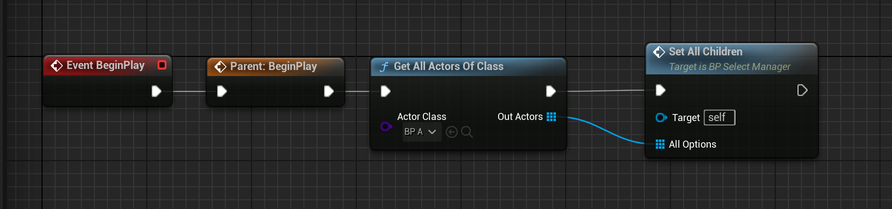 

Method 3: Add options using blueprint nodes

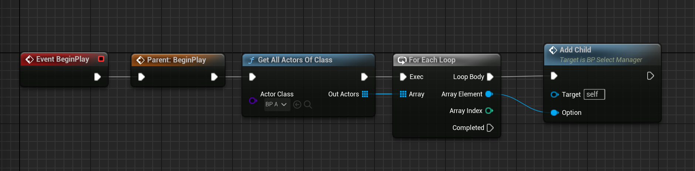 

6.Set different trigger options

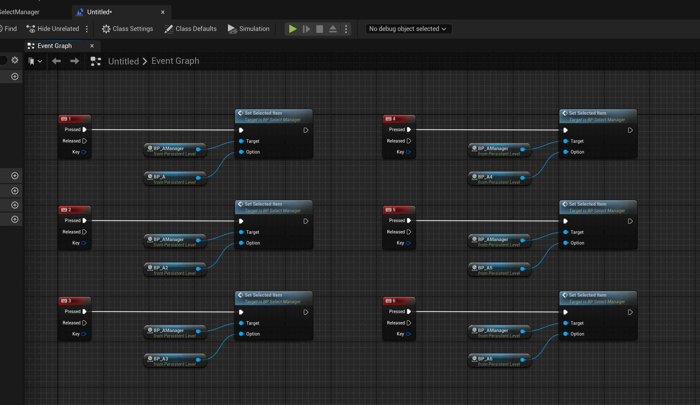 

7.Set radio mode

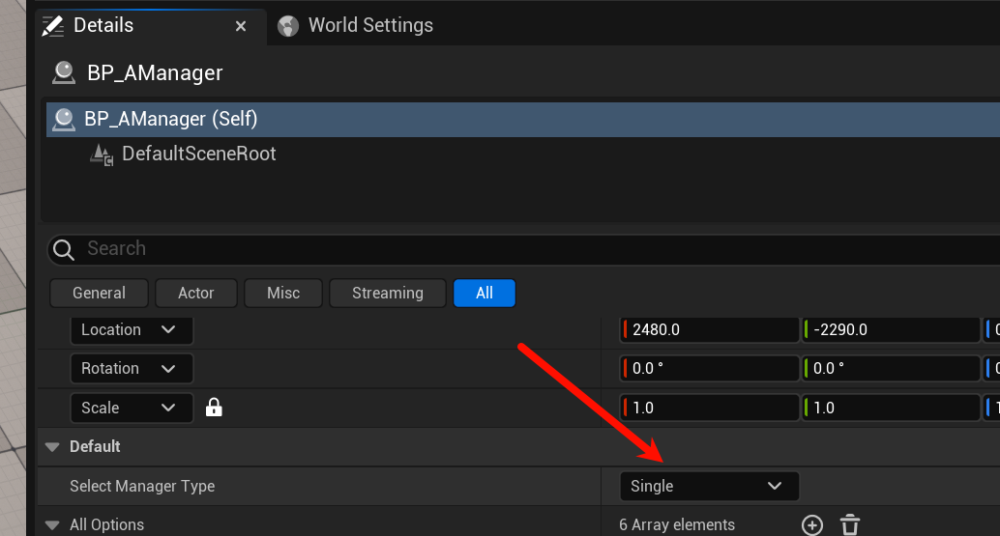 

Press 1：

 

Press 5：

 

9.Set multiple selection mode

 

Press 1：

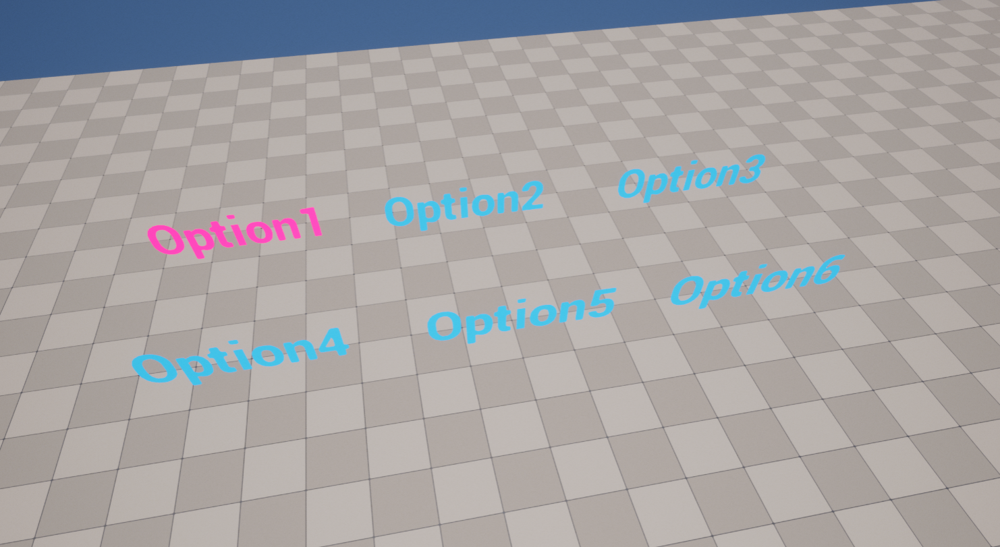 

Press 5：

 

11. Modify button 5 as a switching option

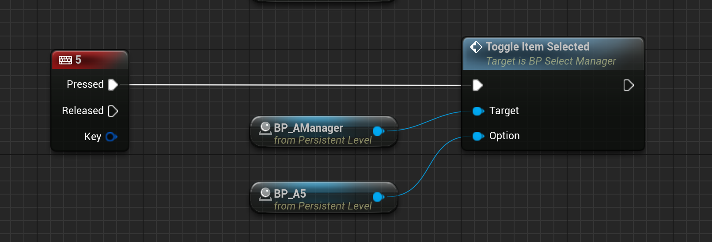 

Press 5.

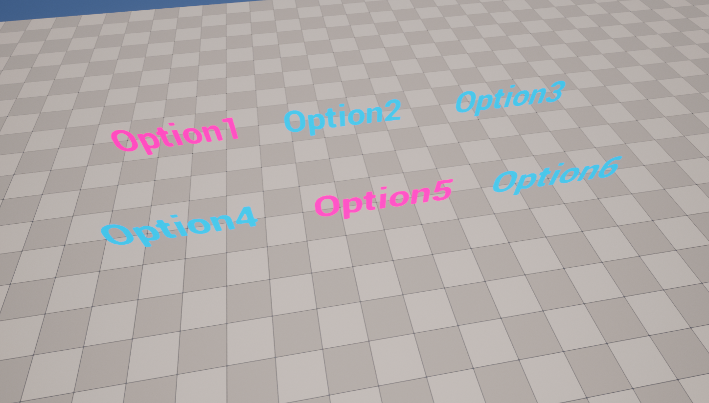

Press 5 again：

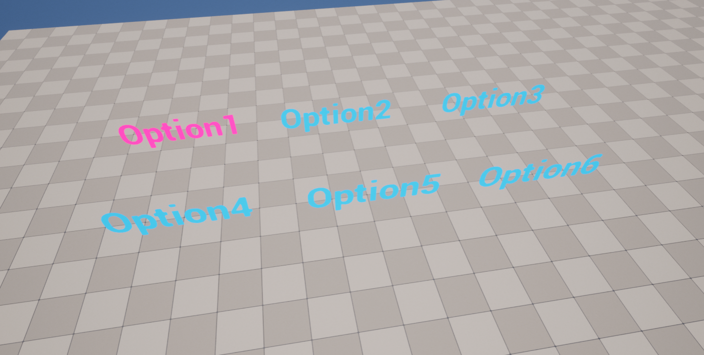

包含的方法：

SelectionMode：

Child：

Select：

EventDispatchers

 